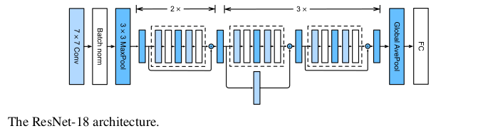

# Arquitectura de Redes Neuronales Convolucionales

## Martín Cogo Belver

## indice

- AlexNet
- VGG
- ResNet
- DenseNet

## AlexNet(2012)

- Fue Creada por Alex Krizhevsky.
- Ganadora del ImageNet challenge.
- Represento una mejora significativa respecto a LeNet.
- Primera implementación utilizando GPU's.
- Esta red demostró que las Features adquiridas mediante el aprendizaje de las red son mucho mejores que las manualmente diseñadas.  
  

### Cambios que trajo AlexNet

- Utiliza la función de activación **ReLU**, a diferencia de LeNet que utiliza la función de activación **Sigmoid**.
- Para controlar la complejidad de las capas totalmente conectadas utiliza la técnica de **dropout**, a diferencia de LeNet que utiliza *weight decay*.
- Utilizo técnicas para aumentar imágenes como flipping, clipping y cambios de color.
- Una desventaja del la arquitectura es que requiere mucha memoria y poder de computo comparada con redes más modernas.  

## VGG (2014)

- VGG *Visual Geometry Group* era un grupo de la universidad de Oxford que propuso crear un esquema de bloques para construir CNN's.

- El bloque básico esta compuesto por:

1. Una *secuencia* de capas convolucionales de 3x3 con **padding** de 1 para mantener su resolución y con función de activación **ReLU**
2. Una capa de *Pooling* de tipo **max-pooling** 2x2 con **stride** de 2.

- La construcción de redes mediante estos bloques hace que la resolución decrezca rápidamente imponiendo un limite a la cantidad de capas que se pueden utilizar.  
  

- La Red VGG original tienen 5 bloques convolucionales, donde los primero 2 tienen 1 capa convolucional y los otros 3 tienen 2 capas convolucionales.  
  

## ResNet (2015)

- Propuesta en un paper por He et al. Con la idea de que en cada capa adicional de la arquitectura debe contener más fácilmente la función que se busca.  
  

- Define entonces los "Residual Blocks" que se utilizan para construir la CNN.  
  
*La idea intuitiva es que la red ya no busca aprender $f(x)$ sino que tan diferente es $f(x)$ respecto a la funcion $y = x$.*

- ResNet-18  
  

## DenseNet (2017)

- Es la extension de la ResNet. ResNet descompone la función en:$$f(x)= x + g(x)$$
entonces, lo que busca DenseNet es encontrar información entre los términos sin necesariamente sumarlos, sino que concatenando.  
  

- Se le llama DenseNet ya que el grafo de dependencias se vuelve denso. $$x → [x, f1 (x), f2 ( [x, f1 (x)]) , f3 ([x, f1 (x) , f2 ([x, f1 (x)])]) , . . .]$$   
  

- Como cada capa que se agrega al modelo incrementa el numero de canales, añadir varias capas lleva a un modelo altamente complejo.

- Para evitar el problema de que al conectar todos los feature maps del modelo entre si sea necesario que tengan el mismo tamaño y mucha memoria.  
  
Para solucionar esto se propone utilizar la conectividad solo en los "Dense Blocks" y unir los bloques con *average-pooling*.

## Comparativa sobre el dataset Fashion-MNIST

<table>
    <tr>
        <th>AlexNet</th>
        <th>VGG</th>
        <th>ResNet</th>
        <th>DenseNet</th>
    </tr>
    <tr>
        <td></td>
        <td></td>
        <td></td>
        <td></td>
    </tr>
</table>

## Referencias

- Dive into deep learning. https://www.amazon.com/Dive-into-Learning-Aston-Zhang/dp/1009389432
- Best deep CNN architectures and their principles: from AlexNet to EfficientNet. https://theaisummer.com/cnn-architectures/#terminology
